 # Sequential Learning App for Materials Discovery ("SLAMD")

Here we present an app for accelerating the experimental search for suitable materials using machine learning. Sequential learning (SL) is frequently recognized as having great potential to accelerate materials research with a small number of highly complex data points. SL ranks the experiments based on their utility. This is done by coupling the predictions of a Machine Learning model with a decision rule that guides the experimental procedure. The underlying idea is that not all experiments are equally useful. Some experiments provide more information than others. In contrast to classical design of experiments (DOE), where (only) the experimental parameters are optimized, the potential outcomes of the experiments themselves are the decisive factor. The most promising experiments are preferred over dead-end experiments and experiments whose outcome is already known. Each new experiment is selected to maximize the amount of useful information, e.g., according to, using previous experiments as a guide for the next experiment. This app can be used for method development and for investigating the configuration of Sequential Learning (SL) methods. 

To determine the performance of SL methods, it is common to use simulated experiments where the ground truth labels for all data points are already known. Initially, only a small fraction is provided to the SL algorithm (although more training data would be available). This is extended with one new data point from the remainder of the available data at each iteration. It is investigated which approach requires the least amount of data to achieve the goal. Approaches that require less data simply lead to faster success in laboratory practice. 

### Thus, the goal is not to actually discover new materials using all available data, but to validate material discovery methods for scenarios where fewer labels are known (e.g., for new materials).

The app provides flexible and low-threshold access to AI methods via user interfaces. It is based on "Jupyter Notebooks" and integrates seamlessly with the "AIIDA" workflow environment. The underlying code can be easily customized and extended. The app has intuitive and interactive user interfaces for data import and cleansing/selection, (statistical) data analysis, visualization for exploration and plausibility, AI environment as well as data evaluation and result visualization. Structured material data from CSV files are used.

## Installation

"SLAMD" needs to install some requirements when not hosted on a Aiidalab plattform.

Use the package manager [pip](https://pip.pypa.io/en/stable/) to install the requirements.txt file (admin rights maybe required for pip install).
Navigate to the app directory and execute the following command in your terminal:

### Python 3
```bash
pip3 install -r requirements.txt
```
### Python 2 or within the Anaconda Prompt

```bash
pip install -r requirements.txt
```
After installing the requirements you need to enable the ui elements:

```bash
jupyter nbextension enable --py widgetsnbextension
```
This app includes the the lolopy Random Forest algorithm with uncertainties from https://github.com/CitrineInformatics/lolo. In order to use this method it is required to instal java SE, e. g. from https://www.oracle.com/java/technologies/javase-jdk16-downloads.html.

### Web-preview 

To launch a web hosted version of SLAMD, follow the link below. Note that the web application may be slow. To get the full performance, we recommend that you install a local copy. 

Link: 

https://mybinder.org/v2/gh/BAMcvoelker/SequentialLearningApp/main?filepath=voila%2Frender%2FSequentialLearningApp.ipynb

## Usage

Navigate to the Directory where you downloaded this Repository and execute this Command in your Terminal

```bash
voila SequentialLearningApp.ipynb
```

A Window in your default browser should open now.

## Background on the used methodology: 

More information on the methodology is available in the publication Völker et al. 2021, entiteled "Sequential learning to accelerate discovery of alkali-activated binders", http://dx.doi.org/10.13140/RG.2.2.18388.94087/1

# Hands on - a quick guide to "SLAMD"

The app is divided into the four main windows "Upload", "Data Info", "Design Space Explorer" and "Sequenital Learning", which are explained below. 

## Upload
In the upload window of the app, the materials data in CSV format can be imported via a dialog. An option to set the CSV separator, the decimal separator and to delete non-numeric data is available. Additionally, lines at the beginning of the file can be skipped (e.g., header information, etc.). At the end of this process, the data is displayed to the user to allow a plausibility check. Here it can be checked quickly and easily whether decimal places are specified correctly, and all data are numeric.
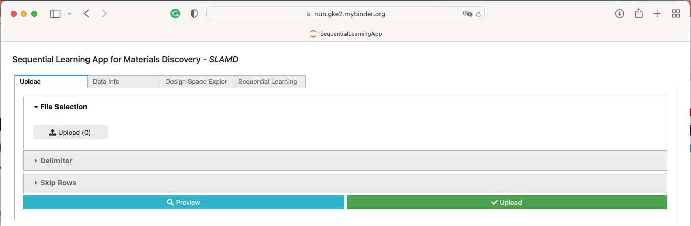
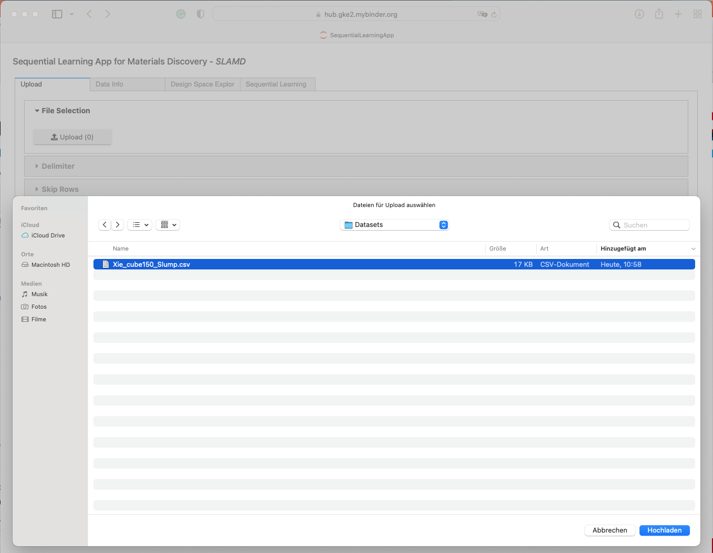
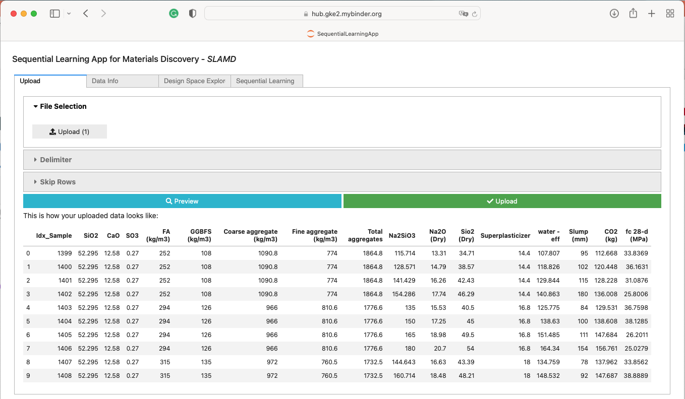

*An example file has been extracted from the paper Xie et al. 2020 https://doi.org/10.1016/j.conbuildmat.2020.119380 and is provided in this repository.

## Data Info
This window gives a detailed overview of the uploaded data. Besides the data preview, there is a detailed list of all variables ('Info' button) and some basic statistical characteristics of the variables ('Stats' button).
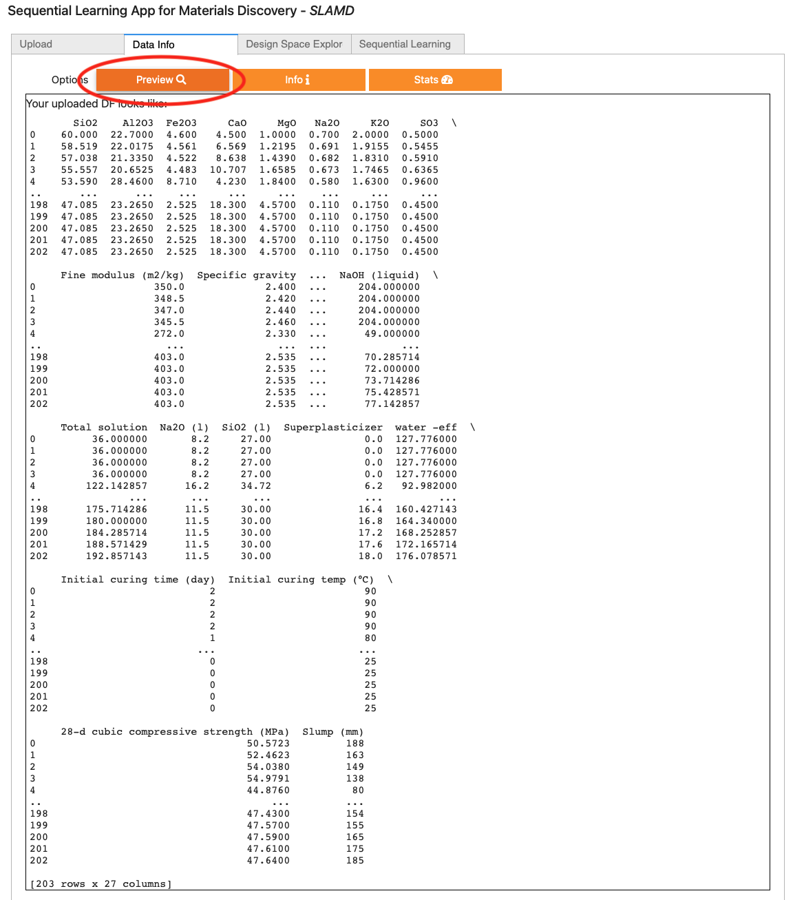
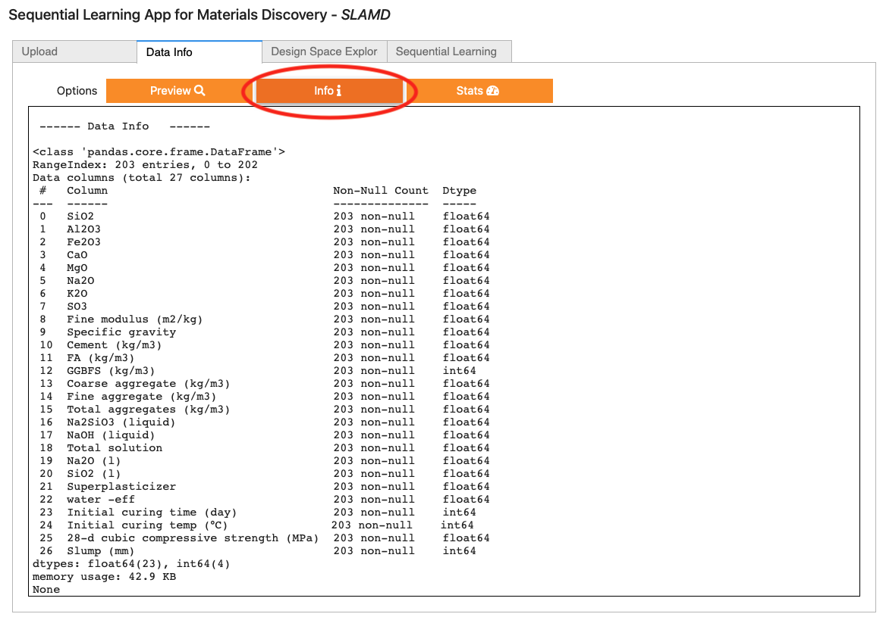
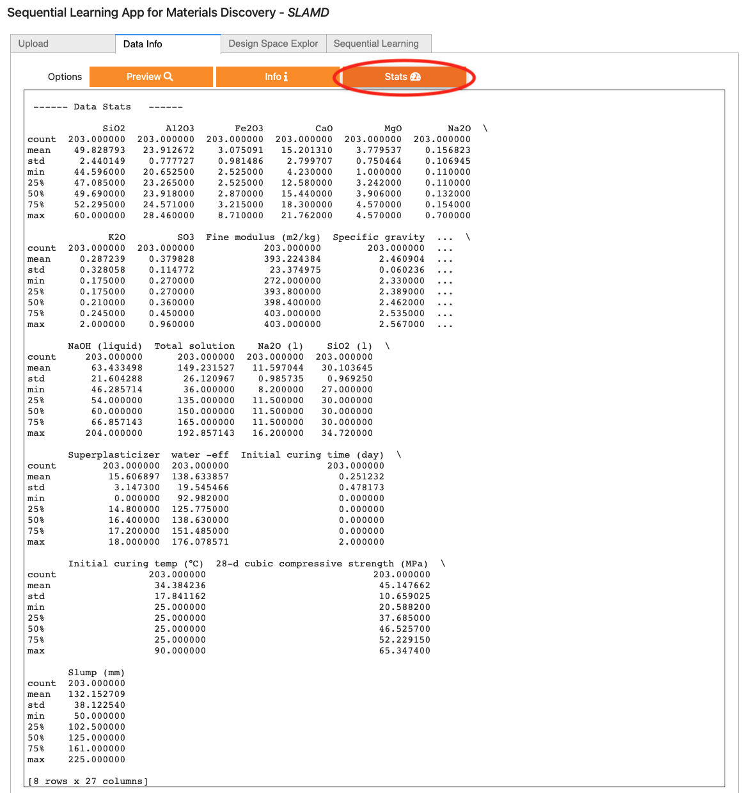

## Design Space Explorer
The Design Space Explorer allows the visualization of complex relationships in the data. Here, specific dependencies between selected variables can be displayed as a scatter plot, the interrelationships and distributions of the variables can be mapped as a scatter matrix, and correlations can be visualized as a correlation heatmap. These tools allow a quick visual overview, e.g. of co-linearities of the characteristics for feature selection or trade-offs between different material properties, which are to be optimized.
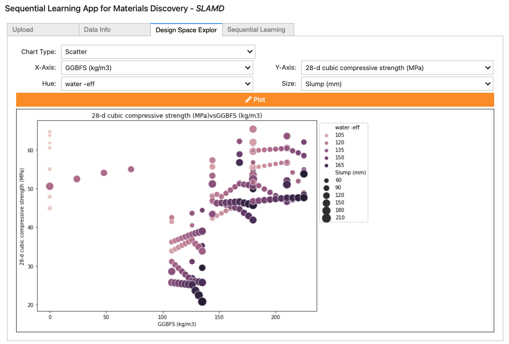
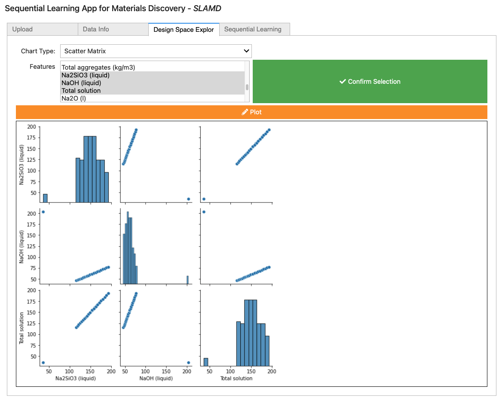
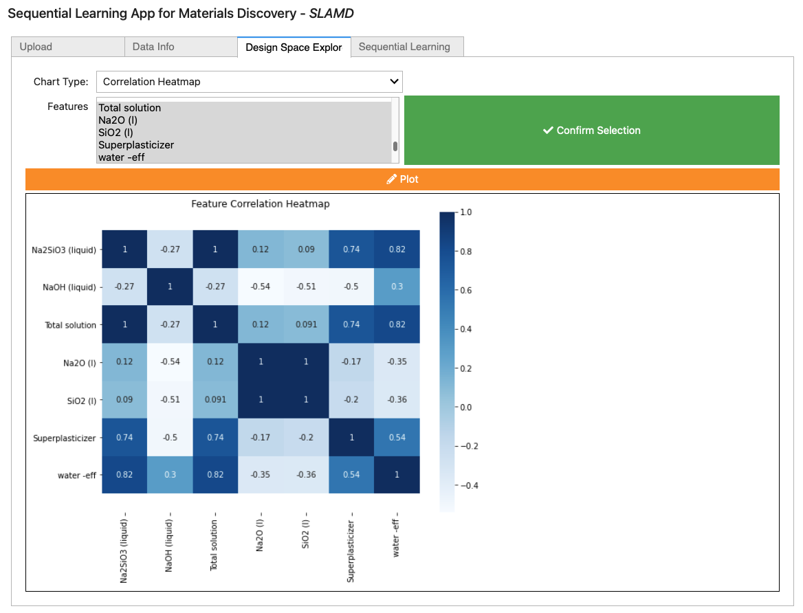

## Sequential Learning
This window provides a SL framework divided into the tabs "Settings" - here the optimization scenario can be defined - and "Seqential Learning Parameters" - here the algorithms can be selected, set and virtual experiments can be performed. 

#### Settings
This window lets the user interactively set up the boundary conditions of the SL problem. The input feature and target properties can be selected simply by mouse click. It is possible to select multiple target properties (Multi-Objective Optimization). The optimization is then based on the sum (or difference - depending on whether maximization or minimization is desired) of the normalized properties. 
**NEW
SLAMD can now consider known targets. Not all targets need verification in the lab. Costs and CO2 footprint, for instance, can be collected from databases upfront. However, they can play an important role in optimization, especially in the case of green materials. The new feature "Fixed target selection" now allows to include such data into the optimization. Their uncertainty is considered to be zero in the  MLI and MLID and MU utility.

The target can be specified as a quantile of the given properties (or their combinations in case of Multi-Objective Optimization). A lower target threshold (e.g. 90%) accelerates the SL optimization. However, this makes it increasingly difficult for SL to outperform a random process. 
The sample threshold determines the restriction of the initial training data. If it was not restricted, it would be possible that the searched material is already contained in the initial data - which would make SL superfluous. The sample threshold is therefore always lower than the target threshold. 
The initial sample size can be chosen below. Some SL algorithms require at least 3 samples. It is recommended to not choose less than 4 initial samples. 
The "Visualize Settings" button generates a qualitative preview of your selected SL task. It presents your data in reduced dimensions using the TSNE algorithm. The location of the available candidates (Determined by the Sample threshold), the targets (determined by the Target threshold) and the samples that may be explored with SL are displayed in color. This makes it easy to visualize the impact of the thresholds and adding or removing features or targets. 
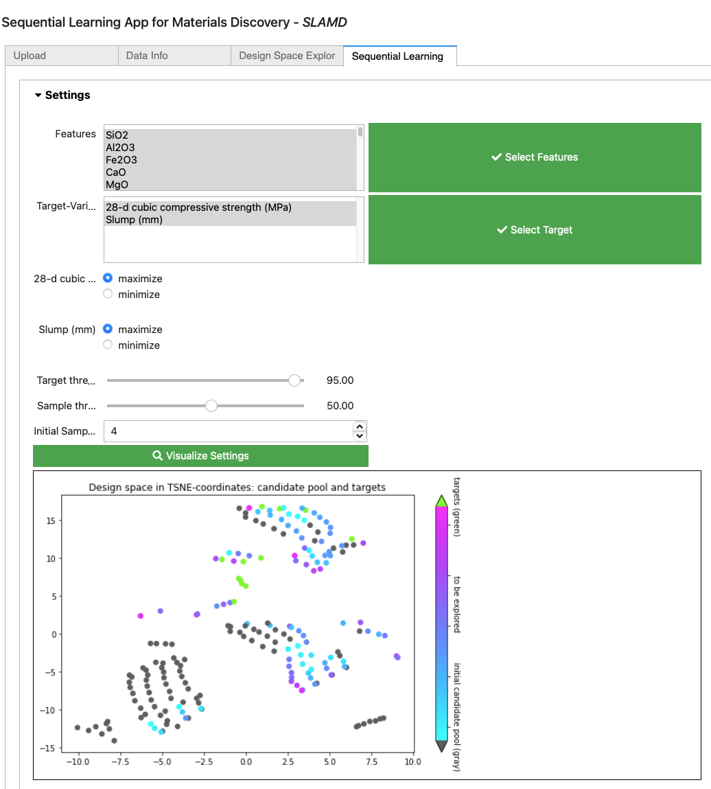

#### Sequential Learning Parameters
This tab lets the user select from several Machine Learning (ML) algorithms and utility functions:

(1) Decision Tree Regression - fast but crude algorithm; good for trying different settings and utility functions (min. initial sample size 2); 

(2) Scikit Random Forest Regression - fast and powerful algorithm; suitable for getting good results (min. initial sample size 2); 

(3) Lolopy Random Forest Regression - fast and powerful algorithm; requires instaltation of JAVA SDK; (min. initial sample size 8); 

(4) Gaussian Process Regression - fast and powerful algorithm; (min. initial sample size 2);  

Some utility functions, such as MEID and MLID, allow to adjust further hyper parameters. As mentioned above, more details on ML algorithms and utility functions can be found in Völker et al. 2021 (Link: http://dx.doi.org/10.13140/RG.2.2.18388.94087/1 ).
The number of randomized SL runs can be set with the “# of SL runs” slider (standard value=30). The “Run” button executes a simulated experiments where the selected SL algorithms solve the optimization problem that has been specified in the “Settings” tab for the set number of SL runs. 

## Live plots
Three plots occur after first iterations to let you monitor the progress of the current SL run. 

The first diagram shows two plots that ilustrat how fast a selected SL algorithm can find its path to the target in input space (left) and output space (right). The progress in the input space is represented in terms of the minimum distances in the design space from the already discovered materials to the targets per SL iterations. The progress in the output space is represented in terms of maximum  property combination from the already discovered material per SL iterations. 

If the discovered materials remain far from the target (in the plot on the left) for many iterations, a more explorative approach may help to improve performance. If it converges quickly, a more exploiting algorithm may improve performance even further. 

If the sampled properties remain low (in the plot on the right) for many iterations it shows, that the predictive power of the ML algorithm is too low. Choosing a better algorithm may improve the performance. 

The histogram below compares the performance in terms of experiments required of the SL algorithm VS a random process. SL is typically compared to a random process (RP) (i.e., without strategy or model) as a baseline benchmark. RPs consider each candidate as equally likely to succeed (uniform distribution). However, the success rate of RP has a nonlinear relationship with the required draws for the case of multiple targets (the size of the target set is controlled by the target threshold in the "Settings" tab of the "Sequential Learning" window). A low target threshold means that RP becomes a much more difficult benchmark.

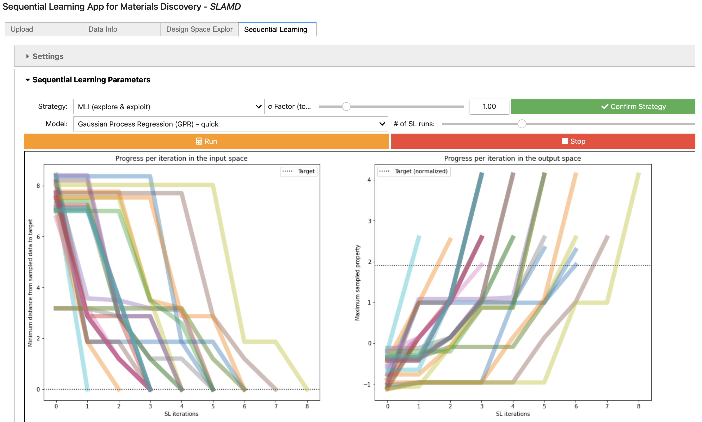

#### Result plots

SL's performance is usually benchmarked in the effort it took for the optimization to reach the target, e.g. in terms of the required experiments. This is a powerful benchmark when it comes to comparing different SL approaches but for the lab scientist other questions can be more important, e.g: what performance improvement of my material properties can I expect after a fixed number of algorithms. This is not always an easy question to answer since some parameters are trade-offs (improving one parameter leads to the deterioration of the other). The new result plots make it now easy for scientists to assess the value that SLAMD creates for any number of SL iterations (compared to not using any optimization, i.e. conducting random experiments).  It shows directly the improvement in terms of the units of the target. 

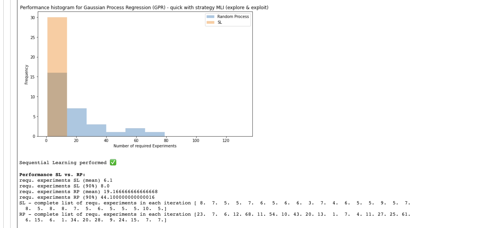

#### History table

The history table is automatically created and stores the settings for each investigated SL scenario. This allows you to easily perform a sensitivity analysis. The table can be downloaded as CSV file. It contains the following information:

##### SL Benchmarks
Requ. experiments (mean):  Mean Performance of SL in terms of the average number of experiment (incl. initial sample set) to reach the target

Requ. experiments (std):   Scattering of SL Performance in terms of the standard deviation 

Requ. experiments (90%):   90 % quantile of SL Perormance (this is the performance that has been achieved in 90% of the cases)

Requ. experiments (max):   Worst performance (in terms of the maximum required experiments)

##### SL Parameters
Algorithm: Selected Machien Learning algorithm

Utlity Function: Selected utility function 

σ Factor: Factor of the uncertainty used by the utility function (in terms of the factor of the standard deviation)

qant. (distance utility): Prediction quantile for distance-based utility

'# SL runs: Number of randomzied scenarios 

##### SL Setting
Initial Sample: Initial training set size

'# of samples in the DS: Size of the design space in terms of the number of candidates.

'# Features: Number of used features

'# Targets: Number of used targets

Target threshold: Threshold to set the Target in terms of the quantile of the targets in the provided data set

Sample threshold: Threshold to restrict initial samples in terms of the quantile of the targets in the provided data set

Features name: Name of the (input) features

Targets name: Name of the (output) targets

##### Detailed Result
Req. experiments (all): A list of all results in terms of the number of required experiments. 

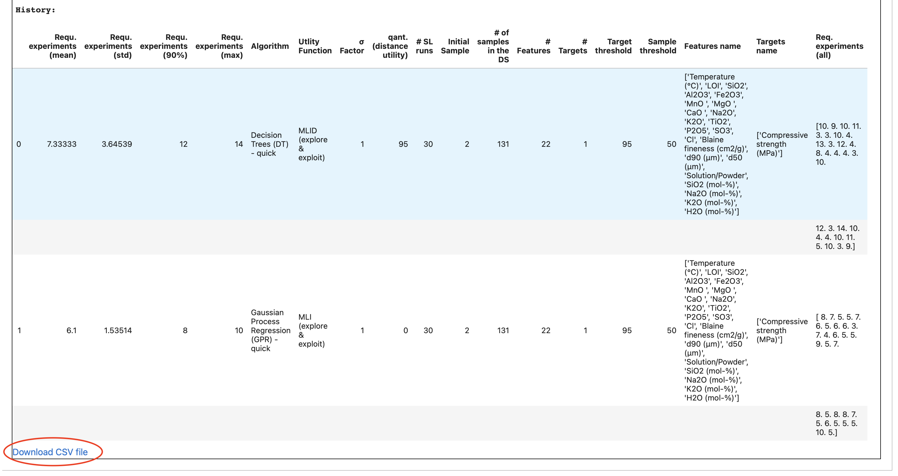

## Conclusion
Serial data collection of SL, even if more successful than RP, can be detrimental in a real-world application, as waiting for experimental results could delay experimental progress. This is especially the case for materials whose synthesis is complex and whose material properties take time to develop or characterize (e.g., 28-day compressive strength of concrete). Collecting all samples at once or in batches may be more successful. 
SL therefore targets material innovations for which data are not available or large-scale data collection would be too expensive. However, what actually provides an advantage in the lab depends heavily on how the SL problem is designed. 
The purpose of "SLAMD" is to provide a tool to quickly explore exactly under what conditions SL can help accelerate research. 


