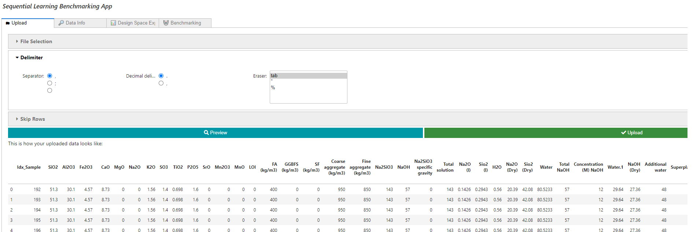
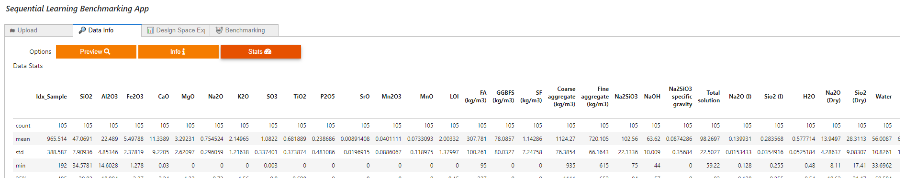
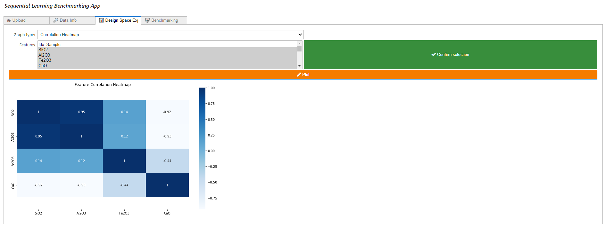
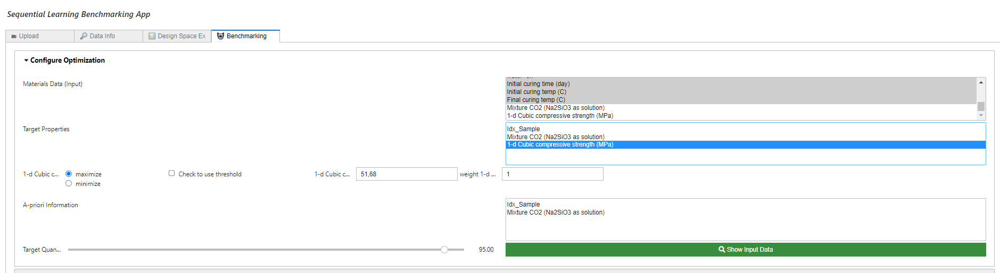
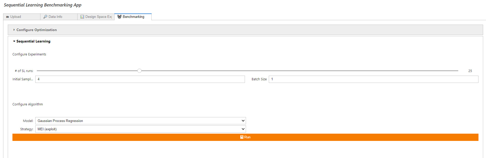
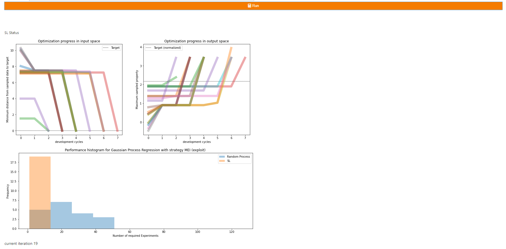
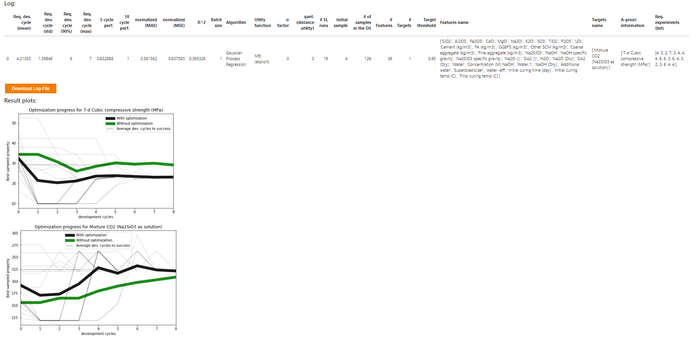

# SLAMD - Sequential Learning Benchmarking App

1. [General Information](#general-information)
2. [Sequential Learning](#sequential-learning)
3. [Installation](#installation)
4. [Starting the App](#starting-the-app)
5. [Known Issues](#known-issues)
6. [Quick Guide](#quick-guide)
7. [Case-Studies](#case-studies)

## General Information

This repository supplements our app "SLAMD - Sequential Learning App for Materials Discovery".
If you are interested in checking it out visit <https://github.com/BAMresearch/WEBSLAMD> and <https://slamd-demo.herokuapp.com/>

Here we focus on evaluating Sequential Learning on various datasets from the literature. 
This is done using the notebook SequentialLearningApp.ipynb located inside the benchmarking folder.
The main purpose is running experiments against known datasets and comparing results for various choices of AI algorithms
and Sequential Learning parameters. The results are compared to baseline random draws. Further, in order to check the baseline
performance of the various ML models, we evaluate R2 scores on all datasets  in a dedicated notebook, baseline_performance.ipynb.

This app is based on Jupyter Notebooks in combination with the UI framework [Voilà](https://github.com/voila-dashboards/voila).
The app runs as a webapp directly in the browser (details concerning the setup can be found below).

## Sequential Learning

Sequential Learning (SL) is frequently recognized as having great potential to accelerate materials research with a small number of highly
complex data points. SL ranks the experiments based on their utility. This is done by coupling the predictions of a Machine Learning model with a
decision rule that guides the experimental procedure. The underlying idea is that not all experiments are equally useful. Some experiments provide
more information than others. In contrast to classical design of experiments (DOE), where (only) the experimental parameters are optimized,
the potential outcomes of the experiments themselves are the decisive factor. The most promising experiments are preferred over dead-end experiments
and experiments whose outcome is already known. Each new experiment is selected to maximize the amount of useful information,
using previous experiments as a guide for the next experiment.

## Installation

Use the package manager [pip](https://pip.pypa.io/en/stable/) to install the `requirements.txt` file (admin rights may be required for pip install).
It is recommended but not mandatory to create a virtual environment with [venv](https://docs.python.org/3/library/venv.html) or [conda](https://docs.conda.io/projects/conda/en/latest/user-guide/tasks/manage-environments.html).

Below we show how to install the dependencies using a virtual environment. If you decide not to use a virtual environment (or conda) simply skip the first two bullet points.

Navigate to the app directory and execute the following commands in your terminal:

- Create a new venv running `python -m venv <name_of_virtualenv>` (in case of errors try to use `python3` instead of `python` in the command)
- Enter venv by executing `.\<name_of_virtualenv>\Scripts\activate` (Windows) or `source /<name_of_virtualenv>/bin/activate` (Unix and Mac)
- Install all dependencies via `pip install -r requirements.txt` (in case of errors try to use `python3` instead of `python` in the command)

This app includes the the lolopy Random Forest algorithm with uncertainties from
<https://github.com/CitrineInformatics/lolo>. In order to use this method it is required to install Java SE, e.g.
from <https://www.oracle.com/de/java/technologies/downloads/#java17>.

**Note:** We tested this setup for the following environments:

- _Windows host machine with Python version 3.10.5 and pip version 21.3.1._
- _Windows host machine with Python version 3.11.1 and pip version 22.3.1._

### Troubleshooting

Depending on your Python version, operating system and/or choice of using virtual environment, conda or working globally,
there might be errors upon installation. In this case, check the error messages and try to either update the library versions
defined in `requirements.txt` or try another version of Python and/or pip.

### Enabling UI elements

After installing the requirements you need to enable the UI elements:

```sh
jupyter nbextension enable --py widgetsnbextension
```

## Starting the App

Once all packages were installed successfully, start the app by running

```sh
voila SequentialLearningApp.ipynb
```

relative to the ``benchmarking`` directory. A window in your default browser should open now. You can now use the app.

### Known Issues

Comma errors may occur when uploading Excel data. It is recommended to use the CSV file format.

If the number of targets is changed during benchmarking, the result plot may not appear. The results will still be saved to the results table,
so there will be no loss of data.

There is still a bug when running Sequential Learning with targets as well as a-priori information with the weight of the a-priori feature
different from 1. For our benchmarking experiments we were looking at the case were all the weights are set to 1, so the corresponding
results for these experiments are still reliable. Note however, that in the "Materials Discovery" part of our [main app](https://github.com/BAMresearch/WEBSLAMD) the issue is already fixed.
Thus in case you want to extend this code and fix the bug, you might find our implementation in [WEBSLAMD](https://github.com/BAMresearch/WEBSLAMD) useful.

## Quick Guide

In this quick guide the functions of the app are described in detail. The app is divided into the four main windows **Upload**, **Data Info**, **Design Space Explorer**,
and **Benchmarking**, which are explained below.

### Upload

In the upload window, the material data can be imported in CSV or Excel format via a dialog. Benchmarking data must be complete, i.e. for each material composition
there must also be (at least) one experimental result.

In the upload dialog it is possible to set the CSV separator and the decimal separator and to delete non-numeric data. In addition, lines at the beginning of the file
can be skipped (e.g. header data, etc.). At the end of this process, the data is displayed to the user for plausibility checking. Here it can be quickly and easily
checked whether the decimal places are correctly specified and all data is numerical.



### Data Info

This window gives a detailed overview of the uploaded data. Besides the data preview, there is a detailed list of all variables ('Info' button) and some basic statistical characteristics of the variables ('Stats' button).



### Design Space Explorer

The Design Space Explorer allows the visualization of complex relationships in the data. Here, specific dependencies between selected variables can be displayed as a
scatter plot, the interrelationships and distributions of the variables can be mapped as a scatter matrix, and correlations can be visualized as a correlation heatmap.
These tools allow a quick visual overview, e.g. of collinearities of the characteristics for feature selection or trade-offs between different material properties,
which are to be optimized.



### Benchmarking

This window provides the core SL framework of our app. This allows you to assess the potential benefits of SLAMD for your application. It is divided into the
tabs "Settings" - here the optimization scenario can be defined - and "Sequential Learning parameters" - here the algorithms can be selected, set and virtual experiments
can be performed.

#### Configure Optimization

This window lets the user interactively set up the boundary conditions of the SL problem. The Materials Data (input feature) and target properties can be selected simply
by mouse click. It is possible to select multiple target properties (Multi-Objective Optimization).
The optimization is then based on the sum (or difference - depending on whether maximization or minimization is desired) of the normalized properties.

SLAMD can also consider a-priori information. Not all targets need verification in the lab. Costs and CO2 footprint, for instance, can be collected from databases upfront.
However, they can play an important role in optimization, especially in the case of green materials. The feature "A-priori Information" allows to include such data
into the optimization. Their uncertainty is considered to be zero in the MLI utility.

The target can be specified as a quantile of the given properties (or their combinations in case of Multi-Objective Optimization). A lower target threshold (e.g. 90%)
accelerates the SL optimization. However, this makes it increasingly difficult for SL to outperform a random process. The target threshold also offers the possibility
to define a default value as the optimization limit (to activate it, the check box must be checked).

The "Show Input Data" button generates a target data table showing the data selected as the target for optimization. 
This makes it easy to check the plausibility of the above configuration.



#### Sequential Learning Parameters

The initial sample size and the batch size can be chosen here. Some SL algorithms require at least 3 samples. It is recommended to not choose less than 4 initial samples.

This tab lets the user select from various fast and powerful algorithms and two utility functions. The algorithms are based on

- Lolopy Random Forest Regression - requires installation of JAVA SDK
- Gaussian Process Regression

For each, three variations are provided with the first basically using standard parameters without any further tuning,
the second one applying a dimensional reduction based on PCA before performing the supervised task, and the third combining
forward feature selection and a rather simple variant of grid search before running the algorithm with the best parameters.
Note that the last variation of the algorithm is computationally quite expensive. As SL is based on many runs, this computation
must be performed in each iteration. So running such an experiment can take some time (depending on the number of runs, a couple of hours).

Concerning utility functions, we provide the two alternatives maximum expected improvement (MEI) and maximum likelihood of improvement (MLI).
The two metrics allow for either predictions with or without uncertainty and include loss on target as well as terms for a-priori information.
More on these (and other) utility functions can be found in [Völker et al. 2021](#case-studies).

The number of randomized SL runs can be set with the "# of SL runs" slider (default value=25). The "Run" button executes a simulated
experiment where the selected SL algorithms solve the optimization problem that has been specified in the "Settings" tab for the set
number of SL runs.



#### Live plots

Three plots occur after the first iteration to let you monitor the progress of the current SL run.
The first diagram shows two plots that illustrate how fast a selected SL algorithm can find its path to the target in input space (left) and output
space (right). The progress in the input space is represented in terms of the minimum distances in the design space from the already discovered materials
to the targets per SL iterations. The progress in the output space is represented in terms of maximum property combination from the already discovered
material per SL iterations.  
If the discovered materials remain far from the target (in the plot on the left) for many iterations, a more exploratory approach may help to improve performance.
If it converges quickly, a more exploiting algorithm may improve performance even further.  
If the sampled properties remain low (in the plot on the right) for many iterations, it shows that the predictive power of the ML algorithm is too low.
Choosing a better algorithm may improve the performance.  
The histogram below compares the performance in terms of experiments required in case of the SL algorithm vs a random process. SL is typically compared
to a random process (RP) (i.e., without strategy or model) as a baseline benchmark. RPs consider each candidate as equally likely to succeed (uniform distribution).
However, the success rate of RP has a nonlinear relationship with the required draws for the case of multiple targets
(the size of the target set is controlled by the target threshold in the "Settings" tab of the "Sequential Learning" window). A low target threshold means that
RP becomes a much more difficult benchmark.



#### Result plots

SL's performance is usually benchmarked in the effort it took for the optimization to reach the target, e.g. in terms of the required experiments.
This is a powerful benchmark when it comes to comparing different SL approaches but for the lab scientist other questions can be more important, e.g. what
performance improvement of my material properties can I expect after a fixed number of algorithms. This is not always an easy question to answer since some
parameters are trade-offs (improving one parameter leads to the deterioration of the other). The result plots make it now easy for scientists to assess the value
that this app creates for any number of SL iterations (compared to not using any optimization, i.e. conducting random experiments). It shows directly the improvement
in terms of the units of the target.



#### Log table

The log table is automatically created and stores the settings and results for each investigated SL scenario. This allows you to easily perform a sensitivity analysis.
The table can be downloaded as CSV file. It contains the following information:

##### SL Benchmarks

- **Req. dev. cycle (mean)**: Mean Performance of SL in terms of the average number of experiment (incl. initial sample set) to reach the target
- **Req. dev. cycle (std)**: Scattering of SL Performance in terms of the standard deviation
- **Req. dev. cycle (90%)**: 90 % quantile of SL Performance (this is the performance that has been achieved in 90% of the cases)
- **Req. dev. cycle (max)**: Worst performance (in terms of the maximum required experiments)
- **5 cycle perf.**: Performance after 5 development cycles; values range from 0 for no performance to 1 for target achieved.
- **10 cycle perf.**: Performance after 10 development cycles; values range from 0 for no performance to 1 for target achieved.
- **normalized (MAE)**: MeCase-Studiesan average prediction performance of model in final iteration on normalized targets.
- **normalized (MSE)**: Mean squared prediction performance of model in final iteration on normalized targets.
- **R^2**: Coefficient of determination of model in final iteration on normalized targets.

##### SL Parameters

- **Batch size**: Size of samples drawn in each dev. cycle
- **Algorithm**: Selected Machine Learning algorithm
- **Utility Function**: Selected utility function
- **σ Factor**: Factor of the uncertainty used by the utility function (in terms of the factor of the standard deviation)
- **qant. (distance utility)**: Prediction quantile for distance-based utility
- **\# SL runs**: Number of randomized scenarios

##### SL Settings

- **Initial Sample**: Initial training set size
- **\# of samples in the DS**: Size of the design space in terms of the number of candidates.
- **\# Features**: Number of used features
- **\# Targets**: Number of used targets
- **Target threshold**: Threshold to set the Target in terms of the quantile of the targets in the provided data set
- **Sample threshold**: Threshold to restrict initial samples in terms of the quantile of the targets in the provided data set
- **Features name**: Name of the (input) features
- **Targets name**: Name of the (output) targets
- **A-priori information**: Name of given targets that do not require prediction (e.g. cost, CO2 footprint, etc.)

##### Detailed Result

- **Req. experiments (all)**: A list of all results in terms of the number of required experiments.

## Case-Studies

- Völker et al. 2022, entitled "ACCELERATING THE SEARCH FOR ALKALI ACTIVATED CEMENTS WITH SEQUENTIAL LEARNING", <http://dx.doi.org/10.13140/RG.2.2.33502.92480/1>
- Völker et al. 2021, entitled "Sequential learning to accelerate discovery of alkali-activated binders", <http://dx.doi.org/10.13140/RG.2.2.18388.94087/1>
- Example data and SLAMD benchmarking results: <https://github.com/BAMcvoelker/SLAMD-FIB-Case-Study>
