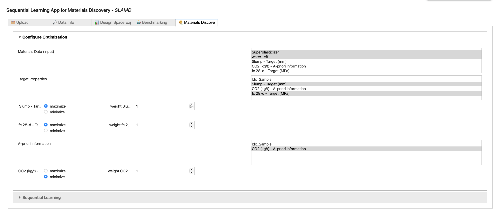
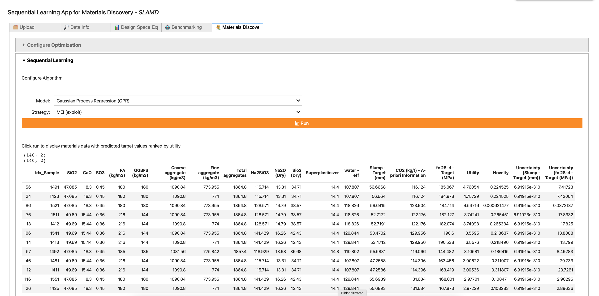

 # Sequential Learning App for Materials Discovery ("SLAMD")


# *NOTE: An updated implementation is deveoloped here: https://github.com/BAMresearch/WEBSLAMD

## Web-preview 

Here we present an app for accelerating the experimental search for suitable materials using machine learning. It is based on "Jupyter Notebooks". The underlying code can be easily customized and extended. 
Sequential learning (SL) is frequently recognized as having great potential to accelerate materials research with a small number of highly complex data points. SL ranks the experiments based on their utility. This is done by coupling the predictions of a Machine Learning model with a decision rule that guides the experimental procedure. The underlying idea is that not all experiments are equally useful. Some experiments provide more information than others. In contrast to classical design of experiments (DOE), where (only) the experimental parameters are optimized, the potential outcomes of the experiments themselves are the decisive factor. The most promising experiments are preferred over dead-end experiments and experiments whose outcome is already known. Each new experiment is selected to maximize the amount of useful information, e.g., according to, using previous experiments as a guide for the next experiment.

### SLAMD lets you validate materials discovery methods.

The app provides flexible and low-threshold access to AI and enables the creation of various optimisation scenarios for benchmarking AI performance. The app has intuitive and interactive user interfaces for data import and data cleaning/selection, (statistical) data analysis, visualization for exploration and plausibility, the AI environment, and data evaluation and result visualization. 

### SLAMD lets you adopt materials discovery methods into practice.

With the *new* Materials Discovery feature, you can perform real-world optimization. All you need is a *csv file with your material data and a column with training data from the lab. Materials that do not yet contain data from the lab are automatically identified as candidates. The SL algorithm makes predictions about the expected experimental results for each candidate and sorts them according to their estimated utility. 

### Case-Studies

Völker et al. 2022, entiteled "ACCELERATING THE SEARCH FOR ALKALI ACTIVATED CEMENTS WITH SEQUENTIAL LEARNING", http://dx.doi.org/10.13140/RG.2.2.33502.92480/1

Völker et al. 2021, entiteled "Sequential learning to accelerate discovery of alkali-activated binders", http://dx.doi.org/10.13140/RG.2.2.18388.94087/1

Example data and SLAMD benchmarking resulsts: https://github.com/BAMcvoelker/SLAMD-FIB-Case-Study 

## Installation

"SLAMD" needs to install some requirements when not hosted on a Aiidalab plattform.

Use the package manager [pip](https://pip.pypa.io/en/stable/) to install the requirements.txt file (admin rights maybe required for pip install).
Navigate to the app directory and execute the following command in your terminal:

### Python 3
```bash
pip3 install -r requirements.txt
```
### Python 2 or within the Anaconda Prompt

```bash
pip install -r requirements.txt
```
After installing the requirements you need to enable the ui elements:

```bash
jupyter nbextension enable --py widgetsnbextension
```
This app includes the the lolopy Random Forest algorithm with uncertainties from https://github.com/CitrineInformatics/lolo. In order to use this method it is required to instal java SE, e. g. from https://www.oracle.com/java/technologies/javase-jdk16-downloads.html.

## Usage

Navigate to the Directory where you downloaded this Repository and execute this Command in your Terminal

```bash
voila SequentialLearningApp.ipynb
```

A Window in your default browser should open now.

## Known Issues:

Comma errors may occur when uploading Excel data. It is recommended to use the *CSV file format.

If the number of targets is changed during benchmarking, the result plot may not appear. The results will still be saved to the results table, so there will be no loss of data. 

# SLAMD Tutorial – Materials Discovery
__
This is a short tutorial that uses a practical example to show how SLAMD can be used in the lab. If you want to apply materials discovery in the lab, you are in the right place. If you are looking for a more comprehensive insight into SLAMDS material discovery algorithms and want to compare different methods in different scenarios, please scroll further to the section "A comprehensive guide to SLAMD". Check out the link for a brief introduction video: https://youtu.be/NhTmx77IbkI

To start SLAMD:
👉 You can launch a preview of SLAMD from the following web address: 

https://bamslamd.herokuapp.com/

👉 You can find complete installation instructions for a local copy above

## Required data
Generally speaking, suitable data characterizes the finished product well. It contains information on the composition and structure of the starting materials, processing steps such as post-treatment and storage conditions, and possibly known properties of the finished products (e.g. a priori information such as carbon footprint, cost delivery times). 
The sample data in the repository includes the following information:

### Material Data: 
Composition of the starting materials and structure: molecular composition of the starting materials from XRD (SiO2, CaO, SO3).
Mixture composition (fly ash and slag, fine and coarse aggregates, water, activator chemicals (Na2SiO3, Na2O (Dry), Sio2 (Dry), superplasticizer.
### Target: 
The Experimentally determined cement properties: Compressive strength (MPa) and slump flow (in mm).
e data are incomplete and include NaNs for the formulations that have not yet been experimentally explored in the laboratory. 
### A-priori Information: 
Existing properties of finished products: CO2 footprint


## Upload data with SLAMD

Clicking the Upload button opens the upload dialog.


Here material data can be selected from the file system. CSV data is preferred, Excel is supported for English file versions. (See MaterialsDiscoveryExampleData.csv & BenchmarkingExampleData.csv as a reference)


The selection must be confirmed by clicking the Upload button. 


A file preview appears below.
If the data appears unstructured, please adjust the delimiter options.

## Data Info

The Data Info (1) field summarizes the properties of the file. Clicking the Info button (2) lists the number of uploaded columns and associated samples. In the example on this slide 17 columns are included in total. In them 156 materials are characterized. 
For 16 materials data already exist from the lab for slump and fc-28-day (Training data).  
This means that out of 156 possible candidates, 16 have already been tested in the laboratory and can be used for training the AI. 


## Design Space Explorer

Visualization tools are implemented in the Design Space Explorer (1) - e.g. a scatter matrix (2). This allows selected features (3) to be easily plotted over each other (4). For example, the compromise between strength and processability for the 16 training data can be seen here. 


## Configure Materials Discovery

In the Materials Discovery window (1) the material optimization is configured. Essentially, the input data (Materials Data (Input)) are selected (2), the target parameters to be optimized in the laboratory (3) and, if available, also A-priori information (4). In the latter case, of course, the goal is a low CO2 footprint, which is why Minimization must still be checked here (5). If some targets are more important than others, the weighting can be increased (6), e.g. to 2 for CO2. Then slump and fc combined would have the same influence as the CO2 value, thus making CO2 the most important optimization criterion. 


## Results

In the following, the prediction can be performed. The Gaussian process regression from scikit is used for this. The Curiosity slider (1) allows you to control the extent to which the model explores new material variants ( More precisely, this value corresponds to the weight of the prediction uncertainty in the utility estimate).  
A higher value enables you to discover "moon-shot" materials that are different from the training materials. This is recommended at the beginning of experimentation and for long-term studies. A low curiosity is recommended when sufficient training data are available, the models are safer, and the training data are close to a target. This more exploitative approach is favorable when deadlines are pressing. If it is unsure, curiosity can be left at a value of 1. 
By clicking on the "Make Prediction" button (2), the experiments are sorted by their utility (3). The table that appears below shows the result of the optimization with SLAMD. 
The calculation of the utility of a material is derived from the predicted material properties (4). The top candidate - in the example with Idx_Sample =1491 - thus has the greatest utility in terms of a good expected property compromise of strength (fc) and processability (slump). This material should be validated in the laboratory next. If the predicted combination of properties is too dominated by one target value, its weighting can be reduced above or the weighting of the undervalued targets can be increased. In this way, the property trade-off can be precisely adapted to the corresponding requirements. 
To estimate the added value of the formulation, Novelty (5) shows a value normalized between 0 and 1, indicating the difference from the formulations, which are already in the training data. For example, the third candidate (Idx_Sample = 86) has a relatively low Novelty (0.0006). Therefore, this formulation does not seem to represent a major change in composition and might therefore receive a lower priority. After all, the goal is to find new formulations as quickly as possible. 
The uncertainty of the predictions is shown as a further aid to decision making (6). Again, candidates with larger uncertainties could be specifically prioritized in order to explore formulations more quickly. 


# A comprehensive guide to SLAMD 

In this quick guide the functions of the app are described in detail. The app is divided into the four main windows "Upload", "Data Info", "Design Space Explorer", "Benchmarking" and "Materials Discovery", which are explained below. 

## Upload
In the upload window, the material data can be imported in CSV or Excel format via a dialog. Benchmarking data must be complete, i.e. for each material composition there must also be (at least) one experimental result. Materials discovery data can be incomplete, i.e. values that have not yet been collected in the lab simply remain empty. SLAMD automatically detects experiments that have already been performed and uses them for training. 

In the upload dialog it is possible to set the CSV separator and the decimal separator and to delete non-numeric data. In addition, lines at the beginning of the file can be skipped (e.g. header data, etc.). At the end of this process, the data is displayed to the user for plausibility checking. Here it can be quickly and easily checked whether the decimal places are correctly specified and all data are numerical.


*An example file has been extracted from the paper Xie et al. 2020 https://doi.org/10.1016/j.conbuildmat.2020.119380 and is provided in this repository.

## Data Info
This window gives a detailed overview of the uploaded data. Besides the data preview, there is a detailed list of all variables ('Info' button) and some basic statistical characteristics of the variables ('Stats' button).


## Design Space Explorer
The Design Space Explorer allows the visualization of complex relationships in the data. Here, specific dependencies between selected variables can be displayed as a scatter plot, the interrelationships and distributions of the variables can be mapped as a scatter matrix, and correlations can be visualized as a correlation heatmap. These tools allow a quick visual overview, e.g. of co-linearities of the characteristics for feature selection or trade-offs between different material properties, which are to be optimized.


## Benchmarking
This window provides an SL framework for benchmarking SL methods against previously completed research. This allows you to assess the potential benefits of SLAMD for your application. It is divided into the tabs "Settings" - here the optimization scenario can be defined - and "Sequential learning parameters" - here the algorithms can be selected, set and virtual experiments can be performed. 

#### Configure Optimization
This window lets the user interactively set up the boundary conditions of the SL problem. The Materials Data (input feature) and target properties can be selected simply by mouse click. It is possible to select multiple target properties (Multi-Objective Optimization). 
The optimization is then based on the sum (or difference - depending on whether maximization or minimization is desired) of the normalized properties. 

SLAMD can now consider a-priori information. Not all targets need verification in the lab. Costs and CO2 footprint, for instance, can be collected from databases upfront. However, they can play an important role in optimization, especially in the case of green materials. The new feature "A-priori Information" now allows to include such data into the optimization. Their uncertainty is considered to be zero in the  MLI and MLID and MU utility.

The target can be specified as a quantile of the given properties (or their combinations in case of Multi-Objective Optimization). A lower target threshold (e.g. 90%) accelerates the SL optimization. However, this makes it increasingly difficult for SL to outperform a random process. The target threshold also offers the possibility to define a default value as the optimization limit (to activate it, the check box must be checked).

The "Visualize Settings" button generates a qualitative preview of your selected SL task. It presents your data in reduced dimensions using the TSNE algorithm. The location of the available candidates (Determined by the Sample threshold), the targets (determined by the Target threshold) and the samples that may be explored with SL are displayed in color. This makes it easy to visualize the impact of the thresholds and adding or removing features or targets. 
The target data table shows the data selected as the target for optimization. This makes it easy to check the plausibility of the above configuration. 


#### Sequential Learning Parameters

The initial sample size and the batch size can be chosen here. Some SL algorithms require at least 3 samples. It is recommended to not choose less than 4 initial samples. 

This tab lets the user select from two algorithms and utility functions:

(1) Lolopy Random Forest Regression - fast and powerful algorithm; requires instaltation of JAVA SDK;

(2) Gaussian Process Regression - fast and powerful algorithm;  

Some utility functions, such as MEID and MLID, allow to adjust further hyper parameters. As mentioned above, more details on ML algorithms and utility functions can be found in Völker et al. 2021 (Link: http://dx.doi.org/10.13140/RG.2.2.18388.94087/1 ).
The number of randomized SL runs can be set with the “# of SL runs” slider (standard value=30). The “Run” button executes a simulated experiments where the selected SL algorithms solve the optimization problem that has been specified in the “Settings” tab for the set number of SL runs. 

## Live plots
Three plots occur after first iterations to let you monitor the progress of the current SL run. 

The first diagram shows two plots that ilustrat how fast a selected SL algorithm can find its path to the target in input space (left) and output space (right). The progress in the input space is represented in terms of the minimum distances in the design space from the already discovered materials to the targets per SL iterations. The progress in the output space is represented in terms of maximum  property combination from the already discovered material per SL iterations. 

If the discovered materials remain far from the target (in the plot on the left) for many iterations, a more explorative approach may help to improve performance. If it converges quickly, a more exploiting algorithm may improve performance even further. 

If the sampled properties remain low (in the plot on the right) for many iterations it shows, that the predictive power of the ML algorithm is too low. Choosing a better algorithm may improve the performance. 

The histogram below compares the performance in terms of experiments required of the SL algorithm VS a random process. SL is typically compared to a random process (RP) (i.e., without strategy or model) as a baseline benchmark. RPs consider each candidate as equally likely to succeed (uniform distribution). However, the success rate of RP has a nonlinear relationship with the required draws for the case of multiple targets (the size of the target set is controlled by the target threshold in the "Settings" tab of the "Sequential Learning" window). A low target threshold means that RP becomes a much more difficult benchmark.


#### Result plots

SL's performance is usually benchmarked in the effort it took for the optimization to reach the target, e.g. in terms of the required experiments. This is a powerful benchmark when it comes to comparing different SL approaches but for the lab scientist other questions can be more important, e.g: what performance improvement of my material properties can I expect after a fixed number of algorithms. This is not always an easy question to answer since some parameters are trade-offs (improving one parameter leads to the deterioration of the other). The new result plots make it now easy for scientists to assess the value that SLAMD creates for any number of SL iterations (compared to not using any optimization, i.e. conducting random experiments).  It shows directly the improvement in terms of the units of the target. 


#### Log table

The log table is automatically created and stores the settings and results for each investigated SL scenario. This allows you to easily perform a sensitivity analysis. The table can be downloaded as CSV file. It contains the following information:

##### SL Benchmarks
Req. dev. cycle (mean):  Mean Performance of SL in terms of the average number of experiment (incl. initial sample set) to reach the target

Req. dev. cycle (std):   Scattering of SL Performance in terms of the standard deviation 

Req. dev. cycle (90%):   90 % quantile of SL Perormance (this is the performance that has been achieved in 90% of the cases)

Req. dev. cycle (max):   Worst performance (in terms of the maximum required experiments)

5 cycle perf.:           Performance after 5 development cycles; values range from 0 for no performance to 1 for target achieved. 

10 cycle perf.:          Performance after 10 development cycles; values range from 0 for no performance to 1 for target achieved. 

normalized (MAE):        Mean average prediction performance of model in final iteration on normalized targets.

normalized (MSE):        Mean squarred prediction performance of model in final iteration on normalized targets.

R^2:                     Coefficient of determination of model in final iteration on normalized targets.


##### SL Parameters

Batch size: Size of samples drawn in each dev. cycle

Algorithm: Selected Machine Learning algorithm

Utlity Function: Selected utility function 

σ Factor: Factor of the uncertainty used by the utility function (in terms of the factor of the standard deviation)

qant. (distance utility): Prediction quantile for distance-based utility

'# SL runs: Number of randomzied scenarios 

##### SL Setting
Initial Sample: Initial training set size

'# of samples in the DS: Size of the design space in terms of the number of candidates.

'# Features: Number of used features

'# Targets: Number of used targets

Target threshold: Threshold to set the Target in terms of the quantile of the targets in the provided data set

Sample threshold: Threshold to restrict initial samples in terms of the quantile of the targets in the provided data set

Features name: Name of the (input) features

Targets name: Name of the (output) targets

A-priori information: Name of given targets that do not require prediction (e.g. cost, CO2 footprint, etc.)

##### Detailed Result
Req. experiments (all): A list of all results in terms of the number of required experiments. 


## *new* Materials discovery

This window provides a SL framework for practical laboratory applications. it is  divided into the tabs "Configure Optimization" - here the optimization scenario can be defined - and "Seqential Learning" - here the algorithms can be selected, and the results will be presented. 

#### Configure Optimization
This window lets the user interactively set up the boundary conditions of the SL task. The Materials Data (input feature), target properties and A-priori Information. can be selected simply by mouse click. It is possible to select multiple target properties (Multi-Objective Optimization). 



#### Sequential Learning Parameters

This tab lets the user select from several Machine Learning (ML) algorithms and utility functions:

(1) Decision Tree Regression - fast but crude algorithm; good for trying different settings and utility functions; 

(2) Scikit Random Forest Regression - fast and powerful algorithm; suitable for getting good results 

(3) Lolopy Random Forest Regression - fast and powerful algorithm; requires instaltation of JAVA SDK; not supported in web-preview;

(4) Gaussian Process Regression - fast and powerful algorithm;  

MEI - Maximum Expected Improvement (exploit knowledge)

MLI - Maximum Likelihood of Improvement (exploit knowledge and explore new possibilites)

The result is a table containing a list of materials ranked by their respective utility, including predicted properties and the novelty of the mixture. The latter is a measure of how different the material is compared to the training data. Higher novelty usually means higher information gain when performing the experiment. 


